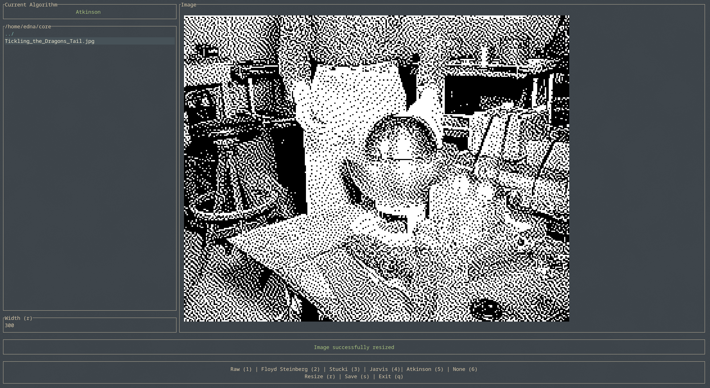

# b2d

A TUI for image dithering with live preview.<br>



If you do not have Rust installed follow the [instructions](https://rust-lang.org/tools/install/).<br> Once installed, enter the directory and run in release mode.

``` bash
cd b2d
cargo run --release
```

You are probably going to need to install [chafa](https://hpjansson.org/chafa/download/) and pkgconf to display the preview.

## Available algorithms

- Floyd Steinberg
- Stucki
- Jarvis
- Atkinson
- None

## Compatibile terminal emulators

See [ratatui-image](https://github.com/ratatui/ratatui-image).

## Disclaimer

100% human coded - all bugs carefully crafted by hand.
